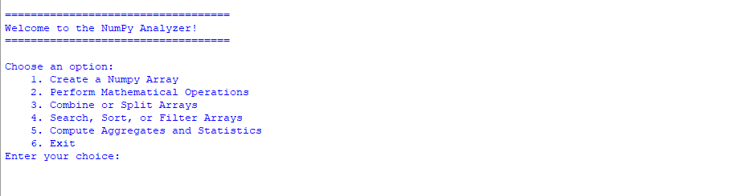
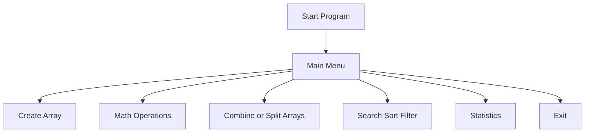
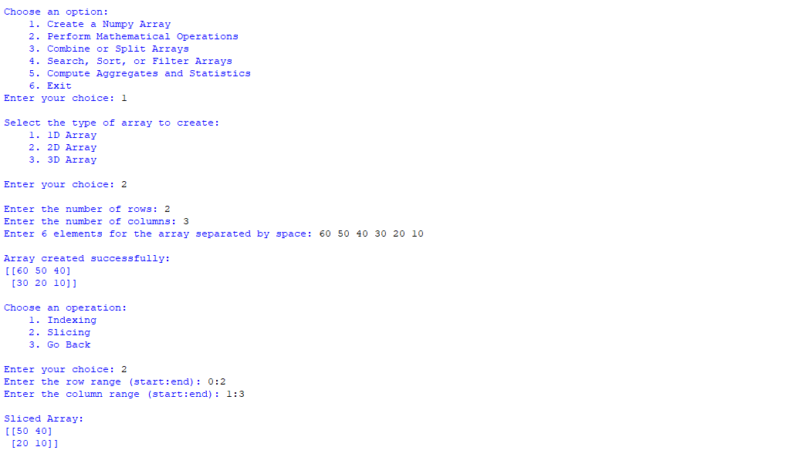
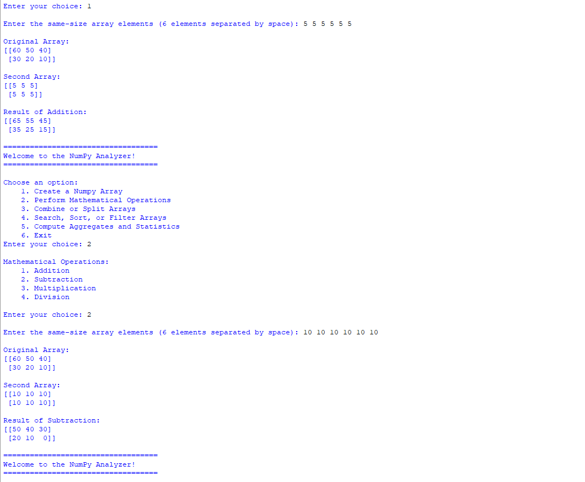
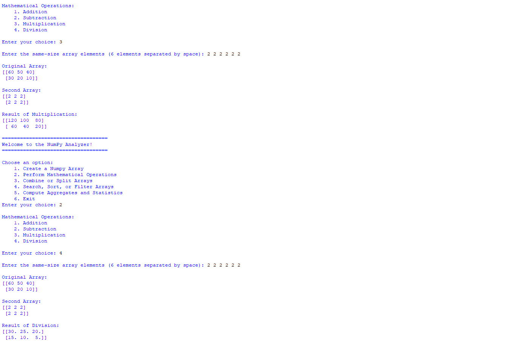
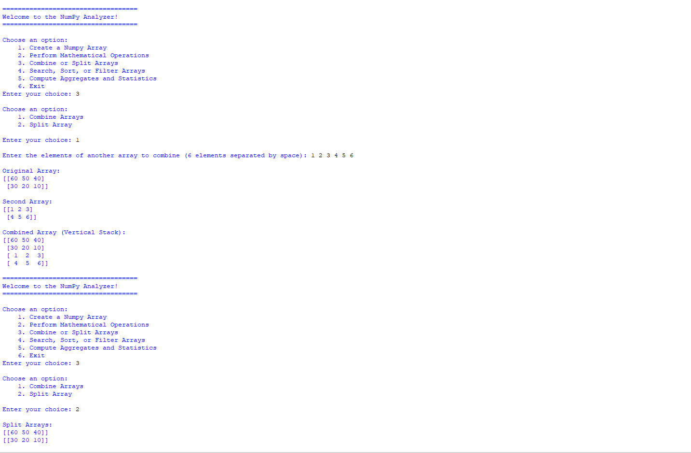
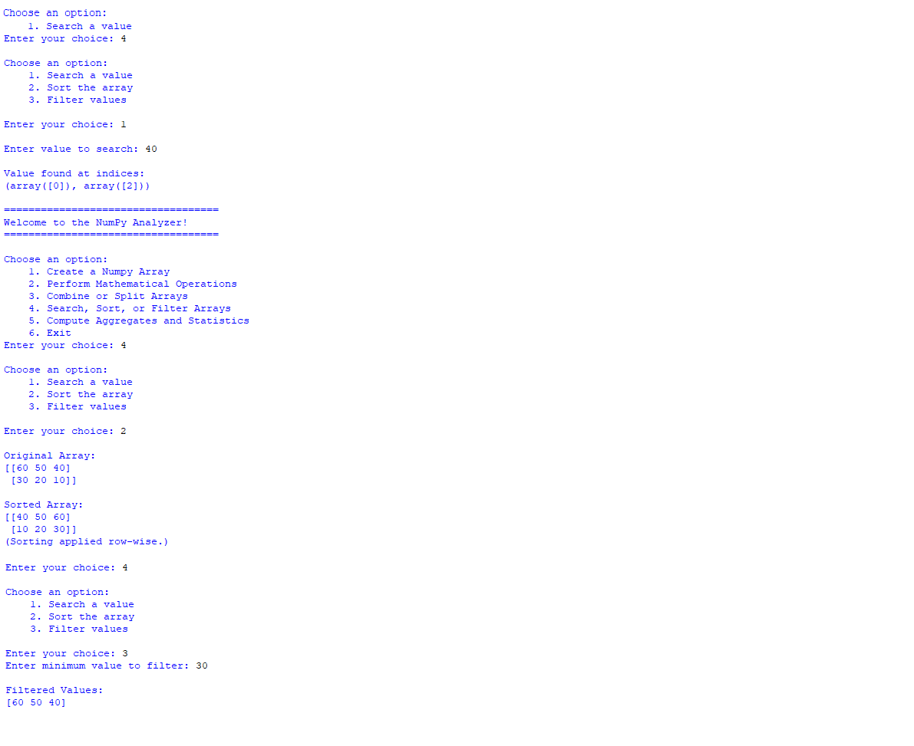
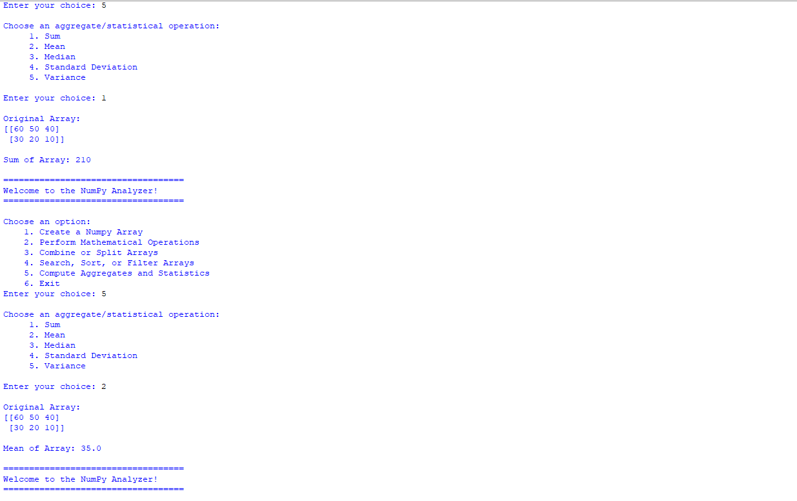
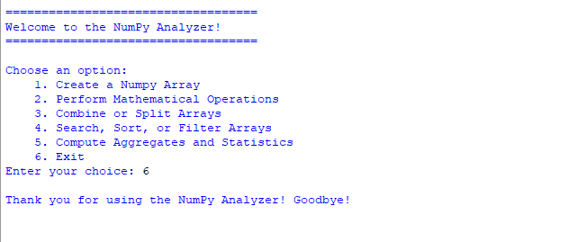

# 📊 NumPy Analyzer (Python CLI)


---

# 📌 Project Overview

**NumPy Analyzer** is a command-line Python application designed to perform data analysis and manipulation using the powerful **NumPy** library.

The program allows users to create arrays and perform multiple analytical operations including mathematical calculations, array transformations, filtering, searching, sorting, and statistical analysis.

This project demonstrates practical usage of **NumPy arrays, data manipulation, and analytical computations** in a structured CLI-based tool.

---

# 🎬 Demo

### Main Menu



---

# ⚙️ Features

| Feature                 | Description                                                   |
| ----------------------- | ------------------------------------------------------------- |
| Array Creation          | Create 1D, 2D, or 3D NumPy arrays                             |
| Mathematical Operations | Perform addition, subtraction, multiplication, and division   |
| Combine & Split Arrays  | Stack arrays or divide arrays into smaller parts              |
| Search, Sort, Filter    | Find values, sort arrays, or filter based on conditions       |
| Statistical Analysis    | Calculate sum, mean, median, standard deviation, and variance |
| Indexing & Slicing      | Extract specific elements or subarrays                        |

---

# 🧠 Skills Demonstrated

* NumPy array manipulation
* Data analysis techniques
* Python class-based design
* CLI application architecture
* Conditional logic
* Array indexing and slicing
* Searching and filtering datasets
* Mathematical and statistical computations

---

# 🧠 Technologies Used

* Python 3
* NumPy Library

---

# 🧭 Program Architecture



---

# 📦 Project Structure

```
numpy-analyzer
│
├── numpy_analyzer.py
│
├── Screenshots
│   ├── main_menu.png
│   ├── Opt1.png
│   ├── add_sub.png
│   ├── multi_div.png
│   ├── opt3.png
│   ├── opt4.png
│   ├── opt5.png
│   └── opt6.png
│
└── README.md
```

---

# 🖥️ Application Walkthrough

---

# 🏠 Main Menu

The main menu provides access to all analytical features in the program.


---

# 1️⃣ Create a NumPy Array

Users can create different types of arrays:

* 1D Array
* 2D Array
* 3D Array

The program also supports **indexing and slicing** operations on 2D arrays.



---

# 2️⃣ Mathematical Operations

Users can perform element-wise mathematical operations between arrays.

Supported operations include:

* Addition
* Subtraction
* Multiplication
* Division

### Addition & Subtraction



### Multiplication & Division



---

# 3️⃣ Combine or Split Arrays

Users can manipulate arrays using NumPy operations such as:

* Vertical stacking (combining arrays)
* Splitting arrays into multiple parts



---

# 4️⃣ Search, Sort, or Filter Arrays

This feature allows users to analyze array data by:

* Searching for specific values
* Sorting rows of arrays
* Filtering elements based on conditions



---

# 5️⃣ Compute Aggregates and Statistics

Statistical analysis can be performed on the dataset.

Supported metrics include:

* Sum
* Mean
* Median
* Standard Deviation
* Variance



---

# 6️⃣ Exit the Program

Gracefully exits the application.



---

# ▶️ How to Run the Project

Clone the repository:

```bash
git clone <repository-url>
```

Navigate to the project folder:

```bash
cd numpy-analyzer
```

Install NumPy if needed:

```bash
pip install numpy
```

Run the program:

```bash
python numpy_analyzer.py
```

---

# 💼 Portfolio Value

This project demonstrates practical knowledge of **NumPy for data analysis and numerical computing**.

It highlights the ability to build structured tools for manipulating and analyzing datasets using Python.

---

# 🔮 Future Improvements

Possible improvements include:

* Support for CSV dataset import
* Visualization using Matplotlib
* Advanced statistical analysis
* Export processed data to files
* GUI version using Tkinter

---

📜 License

This project is released as Open Source.

You are free to use, modify, and distribute this project for learning and educational purposes.

---

👤 Author

Developed as part of a Python portfolio focused on data analysis and numerical computing using NumPy.

---

“The expert in anything was once a beginner who refused to give up.”
— Helen Hayes

Keep building, keep experimenting, and keep learning. 🚀

⭐ If you found this project useful, consider starring the repository!"# Numpy-Analyzer" 
